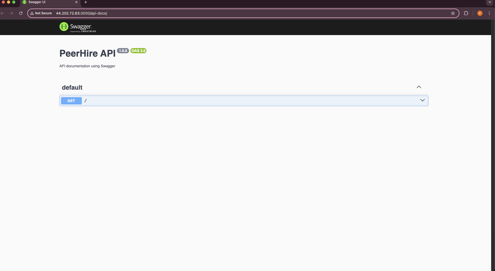
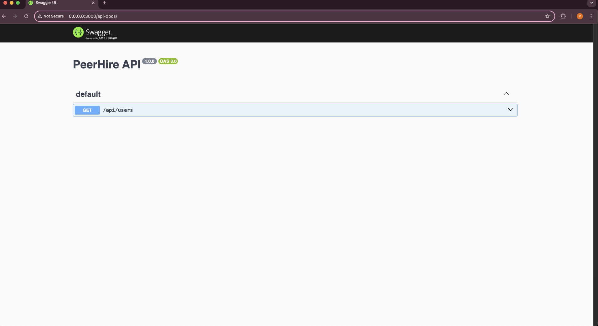

# Full-Stack DevOps Project: Express.js API with CI/CD, Docker & AWS 🚀

This repository demonstrates a complete DevOps workflow, featuring containerization, CI/CD pipeline setup, cloud deployment, Infrastructure as Code, monitoring, and documentation of an Express.js API.

---

## 🧰 Tech Stack

- Node.js / Express.js
- Docker & Docker Compose
- GitHub Actions (CI/CD)
- AWS EC2 (Free Tier)
- Terraform (IaC)
- Swagger & Postman (API Docs)

---

## 🗂️ Project Structure

```
.
├── Dockerfile
├── docker-compose.yml
├── .github/
│   └── workflows/
│       └── ci-cd.yml
├── terraform/
│   ├── main.tf
│   ├── outputs.tf
│   └── provider.tf
├── swagger.js
├── assets/
│   ├── swagger-root.png
│   └── swagger-users.png
├── postman/
│   └── PeerHire API.postman_collection.json
├── index.js
├── package.json
├── package-lock.json
└── README.md
```

---

## 📦 Dockerization

- Built a REST API with Express.js
- Dockerized the app using a `Dockerfile`
- Used `docker-compose.yml` for multi-container setup
- Local run:
  ```bash
  docker-compose up --build
  ```

---

## ⚙️ CI/CD with GitHub Actions

Workflow includes:
- Running unit tests
- Building and pushing Docker image to Docker Hub
- SSH to EC2 and deploying via Docker Compose

`.github/workflows/deploy.yml` handles everything!

---

## ☁️ Cloud Deployment

- Provisioned EC2 instance with Terraform
- Installed Docker, Docker Compose
- GitHub Actions deploys directly to EC2

🌐 **Live API URL:** [http://44.202.72.63:3000/api](http://44.202.72.63:3000/api)

---

## 🧾 API Documentation

### ✅ Swagger UI

- Implemented Swagger UI with `swagger-jsdoc` and `swagger-ui-express`
- Auto-generated from JSDoc comments in route files

📄 Swagger UI URL: [http://44.202.72.63:3000/api-docs](http://44.202.72.63:3000/api-docs)

#### 📸 Screenshots of Swagger UI

- **Root Docs**

  

- **Users Endpoint**

  

---

### 📬 Postman Collection

- Created a Postman collection to test all API routes
- Tested:
  - `GET /api/users`
  - `POST /api/login`
- Exported collection is available for download and import

📥 [Download Postman Collection](https://github.com/prem-pjena/express-api-devops/blob/main/postman/PeerHire%20API.postman_collection.json)

To import:
1. Open Postman
2. Click **Import**
3. Choose the JSON file or paste the GitHub raw URL

---

## 🛠️ Infrastructure as Code (Terraform)

- `terraform/main.tf` provisions an EC2 instance
- Outputs public IP and automates infrastructure setup
- Optional but included for bonus points 🎯

---

## ✅ Project Checklist

- [x] Express.js API created
- [x] Dockerized with `Dockerfile` and `docker-compose.yml`
- [x] GitHub Actions for CI/CD
- [x] AWS EC2 deployment (free-tier)
- [x] Swagger & Postman API documentation
- [x] Terraform provisioning EC2
- [x] Screenshots of Swagger UI in README
- [x] Live API accessible: [http://44.202.72.63:3000/api](http://44.202.72.63:3000/api)

---

## 🙌 Final Thoughts

Thank you for checking out this project!  
I hope it provides a clear glimpse into my approach to DevOps workflows—from containerization to automation and infrastructure provisioning.  
Feel free to explore, fork, and reach out with feedback or suggestions. 🚀
